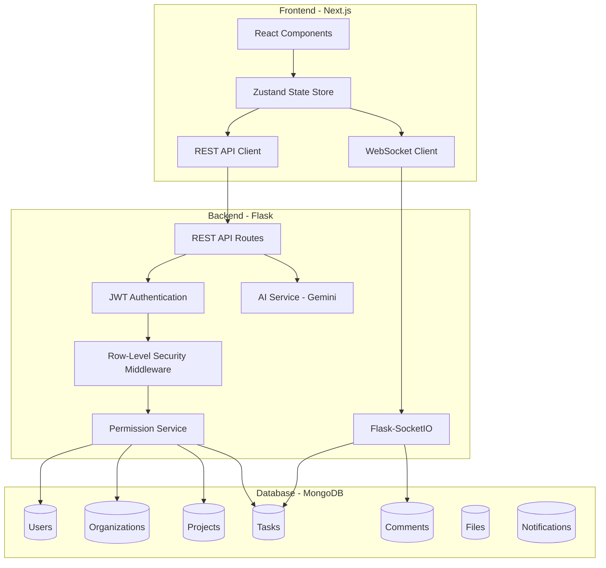

# Design Document

## Overview

This design document outlines the architecture for an AI-Powered Realtime Collaborative Project Management System. The system uses a Next.js frontend, Flask backend with WebSocket support, and MongoDB database. It implements multi-tenant architecture with row-level security, real-time collaboration via WebSockets, a hierarchical permission system, and AI-powered features using the Gemini API.

## Architecture



### Technology Stack

| Layer | Technology | Purpose |
|-------|------------|---------|
| Frontend | Next.js 14 (App Router) | React framework with SSR |
| State Management | Zustand | Lightweight state management |
| Real-time Client | Socket.IO Client | WebSocket communication |
| UI Components | Tailwind CSS + shadcn/ui | Styling and components |
| Drag & Drop | @dnd-kit | Kanban board interactions |
| Backend | Flask | Python REST API |
| Real-time Server | Flask-SocketIO | WebSocket server |
| Authentication | PyJWT | JWT token handling |
| Database | MongoDB + PyMongo | Document database |
| AI | Google Gemini API | Natural language processing |

## Components and Interfaces

### Backend Components

#### 1. Authentication Service
```python
class AuthService:
    def register(email: str, password: str, name: str) -> User
    def login(email: str, password: str) -> TokenPair
    def refresh_token(refresh_token: str) -> TokenPair
    def verify_token(token: str) -> UserContext
    def logout(user_id: str) -> bool
```

#### 2. Organization Service
```python
class OrganizationService:
    def create(name: str, owner_id: str) -> Organization
    def get(org_id: str, user_context: UserContext) -> Organization
    def update(org_id: str, data: dict, user_context: UserContext) -> Organization
    def delete(org_id: str, user_context: UserContext) -> bool
    def invite_member(org_id: str, email: str, role: OrgRole) -> Invitation
    def remove_member(org_id: str, user_id: str) -> bool
    def update_member_role(org_id: str, user_id: str, role: OrgRole) -> Membership
```

#### 3. Project Service
```python
class ProjectService:
    def create(org_id: str, name: str, user_context: UserContext) -> Project
    def get(project_id: str, user_context: UserContext) -> Project
    def list(org_id: str, user_context: UserContext) -> List[Project]
    def update(project_id: str, data: dict, user_context: UserContext) -> Project
    def archive(project_id: str, user_context: UserContext) -> Project
    def add_member(project_id: str, user_id: str, role: ProjectRole) -> ProjectMember
    def remove_member(project_id: str, user_id: str) -> bool
```

#### 4. Task Service
```python
class TaskService:
    def create(project_id: str, data: TaskCreate, user_context: UserContext) -> Task
    def get(task_id: str, user_context: UserContext) -> Task
    def list(project_id: str, filters: TaskFilters, user_context: UserContext) -> List[Task]
    def update(task_id: str, data: TaskUpdate, user_context: UserContext) -> Task
    def update_status(task_id: str, status: TaskStatus, user_context: UserContext) -> Task
    def assign(task_id: str, user_ids: List[str], user_context: UserContext) -> Task
    def add_dependency(task_id: str, depends_on: str, user_context: UserContext) -> Task
    def delete(task_id: str, user_context: UserContext) -> bool
```

#### 5. Comment Service
```python
class CommentService:
    def create(task_id: str, content: str, parent_id: str, user_context: UserContext) -> Comment
    def list(task_id: str, user_context: UserContext) -> List[Comment]
    def update(comment_id: str, content: str, user_context: UserContext) -> Comment
    def delete(comment_id: str, user_context: UserContext) -> bool
```

#### 6. Permission Service
```python
class PermissionService:
    def check_org_permission(user_id: str, org_id: str, action: str) -> bool
    def check_project_permission(user_id: str, project_id: str, action: str) -> bool
    def check_task_permission(user_id: str, task_id: str, action: str) -> bool
    def get_user_permissions(user_id: str, resource_type: str, resource_id: str) -> List[str]
    def get_effective_role(user_id: str, org_id: str, project_id: str) -> EffectiveRole
```

#### 7. Real-time Service
```python
class RealtimeService:
    def join_project(socket_id: str, project_id: str, user_context: UserContext) -> bool
    def leave_project(socket_id: str, project_id: str) -> bool
    def broadcast_task_update(project_id: str, task: Task, action: str) -> None
    def broadcast_comment(task_id: str, comment: Comment) -> None
    def acquire_lock(task_id: str, user_id: str) -> Lock
    def release_lock(task_id: str, user_id: str) -> bool
```

#### 8. AI Service
```python
class AIService:
    def parse_natural_language(text: str, project_context: dict) -> ParsedTask
    def suggest_task_metadata(task: Task, project_context: dict) -> TaskSuggestions
    def suggest_schedule(tasks: List[Task], team: List[User]) -> ScheduleSuggestions
    def analyze_workload(org_id: str, user_context: UserContext) -> WorkloadAnalysis
    def suggest_priority(task: Task, dependencies: List[Task]) -> PrioritySuggestion
```

### Frontend Components

#### 1. State Store (Zustand)
```typescript
interface AppStore {
  // Auth
  user: User | null;
  token: string | null;
  login: (email: string, password: string) => Promise<void>;
  logout: () => void;
  
  // Organizations
  currentOrg: Organization | null;
  organizations: Organization[];
  setCurrentOrg: (org: Organization) => void;
  
  // Projects
  currentProject: Project | null;
  projects: Project[];
  setCurrentProject: (project: Project) => void;
  
  // Tasks
  tasks: Task[];
  tasksByStatus: Record<TaskStatus, Task[]>;
  addTask: (task: Task) => void;
  updateTask: (taskId: string, updates: Partial<Task>) => void;
  moveTask: (taskId: string, newStatus: TaskStatus) => void;
  
  // Real-time
  socket: Socket | null;
  connectSocket: () => void;
  disconnectSocket: () => void;
  
  // Optimistic updates
  pendingUpdates: Map<string, PendingUpdate>;
  applyOptimisticUpdate: (id: string, update: any) => void;
  confirmUpdate: (id: string) => void;
  revertUpdate: (id: string) => void;
}
```

#### 2. React Components Structure
```
/app
  /layout.tsx                 # Root layout with providers
  /page.tsx                   # Landing page
  /(auth)
    /login/page.tsx
    /register/page.tsx
  /(dashboard)
    /layout.tsx               # Dashboard layout with sidebar
    /organizations/page.tsx   # Org list
    /[orgId]
      /page.tsx               # Org dashboard
      /settings/page.tsx      # Org settings
      /members/page.tsx       # Member management
      /projects/page.tsx      # Project list
      /[projectId]
        /page.tsx             # Kanban board
        /settings/page.tsx    # Project settings
        /tasks/[taskId]/page.tsx  # Task detail
/components
  /ui                         # shadcn components
  /auth                       # Auth forms
  /organization               # Org components
  /project                    # Project components
  /task                       # Task components
    /TaskCard.tsx
    /TaskDetail.tsx
    /KanbanBoard.tsx
    /KanbanColumn.tsx
  /comments                   # Comment components
  /notifications              # Notification components
  /ai                         # AI feature components
```

## Data Models

### User
```typescript
interface User {
  _id: ObjectId;
  email: string;
  password_hash: string;
  name: string;
  avatar_url?: string;
  created_at: Date;
  updated_at: Date;
}
```

### Organization
```typescript
interface Organization {
  _id: ObjectId;
  name: string;
  slug: string;
  owner_id: ObjectId;
  settings: OrgSettings;
  created_at: Date;
  updated_at: Date;
}

interface OrgMembership {
  _id: ObjectId;
  org_id: ObjectId;
  user_id: ObjectId;
  role: 'owner' | 'admin' | 'member' | 'guest';
  joined_at: Date;
  invited_by: ObjectId;
  status: 'active' | 'pending' | 'inactive';
}
```

### Project
```typescript
interface Project {
  _id: ObjectId;
  org_id: ObjectId;
  name: string;
  description?: string;
  status: 'active' | 'archived';
  settings: ProjectSettings;
  created_by: ObjectId;
  created_at: Date;
  updated_at: Date;
}

interface ProjectMember {
  _id: ObjectId;
  project_id: ObjectId;
  user_id: ObjectId;
  role: 'project_manager' | 'contributor' | 'viewer';
  added_at: Date;
  added_by: ObjectId;
}
```

### Task
```typescript
interface Task {
  _id: ObjectId;
  project_id: ObjectId;
  org_id: ObjectId;  // Denormalized for RLS
  title: string;
  description?: string;
  status: 'backlog' | 'todo' | 'in_progress' | 'review' | 'done';
  priority: 'low' | 'medium' | 'high' | 'critical';
  assignees: ObjectId[];
  creator_id: ObjectId;
  due_date?: Date;
  time_estimate_hours?: number;
  dependencies: ObjectId[];  // Task IDs this task depends on
  blocked_by: ObjectId[];    // Computed: tasks blocking this one
  version: number;           // For conflict detection
  completed_at?: Date;
  created_at: Date;
  updated_at: Date;
}

interface TaskStatusHistory {
  _id: ObjectId;
  task_id: ObjectId;
  from_status: string;
  to_status: string;
  changed_by: ObjectId;
  changed_at: Date;
}
```

### Comment
```typescript
interface Comment {
  _id: ObjectId;
  task_id: ObjectId;
  org_id: ObjectId;  // Denormalized for RLS
  author_id: ObjectId;
  content: string;
  parent_id?: ObjectId;  // For threading
  is_deleted: boolean;
  edited_at?: Date;
  created_at: Date;
}
```

### File Attachment
```typescript
interface FileAttachment {
  _id: ObjectId;
  task_id: ObjectId;
  org_id: ObjectId;
  filename: string;
  original_name: string;
  mime_type: string;
  size_bytes: number;
  uploaded_by: ObjectId;
  storage_path: string;
  created_at: Date;
}
```

### Notification
```typescript
interface Notification {
  _id: ObjectId;
  user_id: ObjectId;
  org_id: ObjectId;
  type: 'task_assigned' | 'task_updated' | 'comment_added' | 'due_date_reminder' | 'mention';
  title: string;
  message: string;
  resource_type: 'task' | 'project' | 'comment';
  resource_id: ObjectId;
  is_read: boolean;
  created_at: Date;
}
```

### Task Lock (for drag-and-drop)
```typescript
interface TaskLock {
  _id: ObjectId;
  task_id: ObjectId;
  user_id: ObjectId;
  socket_id: string;
  acquired_at: Date;
  expires_at: Date;  // Auto-release after timeout
}
```


## Correctness Properties

*A property is a characteristic or behavior that should hold true across all valid executions of a system-essentially, a formal statement about what the system should do. Properties serve as the bridge between human-readable specifications and machine-verifiable correctness guarantees.*

### Property 1: Row-Level Security Isolation
*For any* user belonging to an organization and *for any* data query, all returned results SHALL contain only records where org_id matches the user's organization identifier.
**Validates: Requirements 1.2, 1.4, 1.5**

### Property 2: Organization Membership Integrity
*For any* invitation to an organization with a specified role, accepting the invitation SHALL create a membership record with that exact role, and the user SHALL have permissions consistent with that role.
**Validates: Requirements 2.1, 2.2**

### Property 3: Member Removal Cascade
*For any* member removed from an organization, the member SHALL have zero project assignments and zero accessible resources within that organization after removal.
**Validates: Requirements 2.4**

### Property 4: Project Organization Association
*For any* project created by a user, the project's org_id SHALL equal the user's current organization, and the project SHALL have default configurations applied.
**Validates: Requirements 3.1**

### Property 5: Project Visibility Filtering
*For any* user listing projects, the returned projects SHALL be a subset of projects where the user has at least viewer permission within their organization.
**Validates: Requirements 3.3**

### Property 6: Task Creation Defaults
*For any* task created in a project, the task SHALL have a unique identifier, status equal to "backlog", and creator_id equal to the creating user's ID.
**Validates: Requirements 4.1, 5.1**

### Property 7: Task Priority Validation
*For any* task priority assignment, the system SHALL accept only values in the set {low, medium, high, critical} and reject all other values.
**Validates: Requirements 4.3**

### Property 8: Task Status Validation
*For any* task status transition, the system SHALL accept only values in the set {backlog, todo, in_progress, review, done} and reject all other values.
**Validates: Requirements 5.2**

### Property 9: Task Status History Logging
*For any* task status change, a history record SHALL be created containing the previous status, new status, user ID, and timestamp.
**Validates: Requirements 5.5**

### Property 10: Circular Dependency Prevention
*For any* dependency creation attempt that would create a cycle in the dependency graph, the system SHALL reject the operation and return an error.
**Validates: Requirements 6.4**

### Property 11: Dependency Blocking State
*For any* task with incomplete blocking dependencies, the task's blocked_by array SHALL contain all incomplete blocking task IDs, and completing a blocking task SHALL remove it from blocked_by.
**Validates: Requirements 6.2, 6.3**

### Property 12: Comment Threading Integrity
*For any* reply comment, the parent_id SHALL reference an existing comment on the same task, and listing comments SHALL return replies nested under their parent.
**Validates: Requirements 7.2, 7.5**

### Property 13: Comment Soft Delete
*For any* deleted comment, the comment SHALL have is_deleted=true and SHALL NOT appear in normal listings, but SHALL be retrievable for audit purposes.
**Validates: Requirements 7.4**

### Property 14: File Attachment Metadata
*For any* uploaded file, the attachment record SHALL contain filename, size_bytes, mime_type, uploaded_by, and a valid storage_path.
**Validates: Requirements 8.1, 8.2**

### Property 15: Real-time Broadcast Delivery
*For any* task modification in a project, all WebSocket connections subscribed to that project SHALL receive a broadcast event containing the updated task data.
**Validates: Requirements 9.1, 9.3, 11.1**

### Property 16: Task Lock Exclusivity
*For any* task with an active lock, no other user SHALL be able to acquire a lock on that task until the lock expires or is released.
**Validates: Requirements 11.2, 11.3, 11.4**

### Property 17: Notification Creation on Assignment
*For any* task assignment, a notification SHALL be created for each assigned user with type "task_assigned" and resource_id equal to the task ID.
**Validates: Requirements 10.1**

### Property 18: Notification Ordering
*For any* notification listing, unread notifications SHALL appear before read notifications, and within each group, notifications SHALL be sorted by created_at descending.
**Validates: Requirements 10.5**

### Property 19: Optimistic Update Reversion
*For any* server-rejected change, the client state SHALL revert to the pre-optimistic-update state within the timeout period.
**Validates: Requirements 12.3**

### Property 20: Version Conflict Detection
*For any* concurrent edits to the same task with the same version number, the system SHALL detect the conflict and preserve both versions.
**Validates: Requirements 13.1, 13.2**

### Property 21: Organization Role Permissions
*For any* user with an organization role, the user's effective permissions SHALL match the role definition: owner has full access, admin has project creation and invitation, member has assigned project access, guest has read-only shared access.
**Validates: Requirements 14.1, 14.2, 14.3, 14.4**

### Property 22: Project Role Permissions
*For any* user with a project role, the user's effective permissions SHALL match the role definition: project_manager has full project access, contributor has task CRUD and commenting, viewer has read-only access.
**Validates: Requirements 15.1, 15.2, 15.3**

### Property 23: Permission Inheritance Chain
*For any* permission check, the system SHALL evaluate organization role first, then project role, then task-specific permissions, and a higher-level grant SHALL short-circuit lower-level checks.
**Validates: Requirements 17.1, 17.2**

### Property 24: Task Creator Permissions
*For any* task, the creator SHALL have edit and delete permissions regardless of their project role.
**Validates: Requirements 16.1**

### Property 25: Natural Language Parsing Extraction
*For any* natural language input containing task information, the parser SHALL extract title, and when present: assignee names, temporal expressions as due dates, and urgency indicators as priority.
**Validates: Requirements 20.1, 20.2, 20.3, 20.4**

### Property 26: JSON Serialization Round-Trip
*For any* domain object, serializing to JSON and deserializing back SHALL produce an equivalent object, with dates in ISO 8601 format and ObjectIds as strings.
**Validates: Requirements 21.1, 21.2, 21.3, 21.4, 21.5**

## Error Handling

### API Error Responses
All API errors follow a consistent format:
```json
{
  "error": {
    "code": "ERROR_CODE",
    "message": "Human-readable message",
    "details": {}
  }
}
```

### Error Codes
| Code | HTTP Status | Description |
|------|-------------|-------------|
| AUTH_INVALID_CREDENTIALS | 401 | Invalid email or password |
| AUTH_TOKEN_EXPIRED | 401 | JWT token has expired |
| AUTH_UNAUTHORIZED | 403 | User lacks permission |
| RESOURCE_NOT_FOUND | 404 | Requested resource doesn't exist |
| VALIDATION_ERROR | 400 | Request data validation failed |
| CONFLICT_DETECTED | 409 | Version conflict on update |
| CIRCULAR_DEPENDENCY | 400 | Dependency would create cycle |
| TASK_LOCKED | 423 | Task is locked by another user |
| RATE_LIMITED | 429 | Too many requests |

### WebSocket Error Events
```typescript
interface WSError {
  event: 'error';
  code: string;
  message: string;
  task_id?: string;
}
```

## Testing Strategy

### Unit Testing
- Framework: pytest (backend), Jest (frontend)
- Coverage target: 80% for core business logic
- Focus areas:
  - Permission evaluation logic
  - Task status transitions
  - Dependency cycle detection
  - Data validation

### Property-Based Testing
- Framework: Hypothesis (Python backend)
- Minimum iterations: 100 per property
- Each property test tagged with: `**Feature: ai-project-management, Property {N}: {description}**`

Property tests will cover:
1. Row-level security filtering (Property 1)
2. Task validation (Properties 6, 7, 8)
3. Circular dependency detection (Property 10)
4. Permission inheritance (Properties 21, 22, 23)
5. JSON serialization round-trip (Property 26)

### Integration Testing
- API endpoint testing with test database
- WebSocket event flow testing
- Multi-user concurrent operation testing

### End-to-End Testing
- Framework: Playwright
- Critical user flows:
  - Organization creation and member invitation
  - Project and task CRUD
  - Kanban board drag-and-drop
  - Real-time collaboration between users
